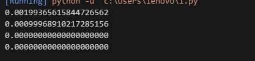
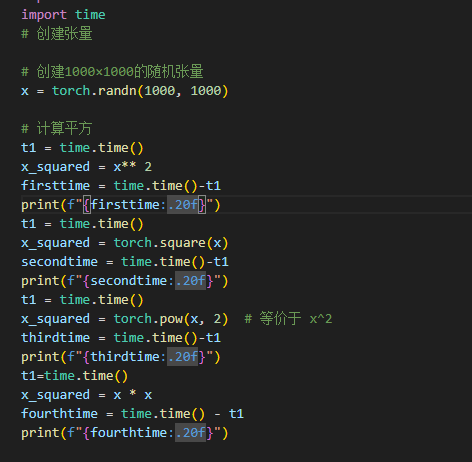
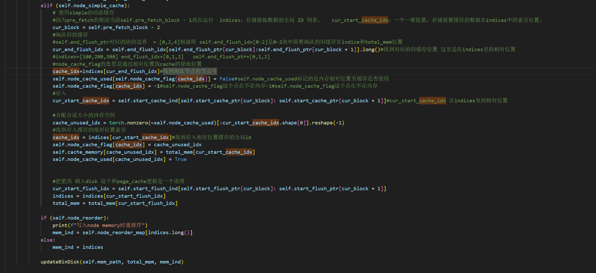
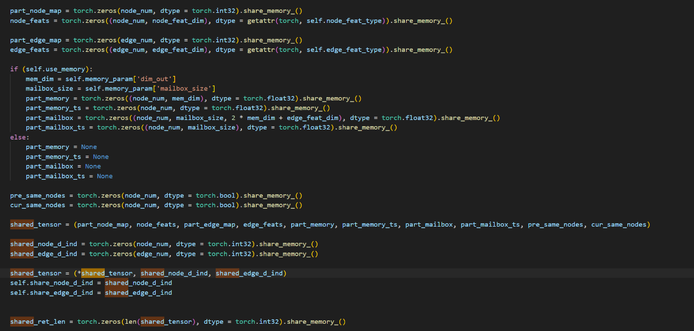

-dzz\
torch平方算法，torch的平方算法是torch.pow(x, 2)，其中x是输入的张量。这个函数会返回一个新的张量，其中每个元素都是输入张量对应元素的平方。

\
说明对于某一问题进行越针对性的话，则对于时间效率会更好，因为通用化优化使得时间变差。

-lj\
对稀疏矩阵进行计算优化

CSR 格式优化：在 spmm.cpp 和 sddmm.cpp 中，针对 CSR 格式（行指针 + 列索引）设计专用核函数。CSR 适合按行访问，通过 rowptr 快速定位每行非零元素，减少内存访问冗余，尤其在 SpMM 中可高效实现 “行聚合” 计算。\
COO 格式优化：在 sddmm.cpp 中支持 COO 格式，适合边列表形式的稀疏数据，在 SDDMM 计算边权重时可直接通过 rowind 和 colind 索引节点特征，避免格式转换开销。\
[ge-spmm](https://github.com/hgyhungry/ge-spmm)

-lhk\
cuda随机数引擎

`thrust::sort(thrust::host, data.begin(), data.end());  // host_policy`\
使用 thrust::host 策略时，排序操作在 CPU 上执行，适用于存储在主机内存（如普通数组、thrust::host_vector）的数据。
内部通常采用适合 CPU 的排序算法（如快速排序的变体），利用 CPU 的缓存和指令集优化。

`thrust::sort(thrust::device, data.begin(), data.end());  // device_policy`\
使用 thrust::device 策略时，排序操作在 GPU 上执行，适用于存储在设备内存（如 thrust::device_vector）的数据。
内部通常采用适合 GPU 的排序算法（如 Coalesced Global Memory Access 的排序算法），利用 GPU 的并行计算能力和内存层次结构优化。

-zwb\
PageCache:电脑的主存可以使用存储在磁盘中的数据。操作系统会将磁盘中的数据分区成固定大小的区块，称为“页”（pages）。当需要时，将数据加载到主存中。
\
在具体代码使用中1.把旧缓存的位置淘汰掉 2.写入缓存3.写入硬盘。\

mmap:share_memory_()：PyTorch 封装的方法，底层隐式调用 mmap 实现张量数据的共享。进程间的数据分享主要有两种共享和发送，共享是指用同一份的内存 disk 甚至文件（两个进程将自己的变量都映射到对应位置）但需要注意“脏“问题。发送则是一个进程把自己的运算结果以某种方式传输到另一个进程可用的地方（进程的隔离），需要注意的是消息传递之间的逻辑。
